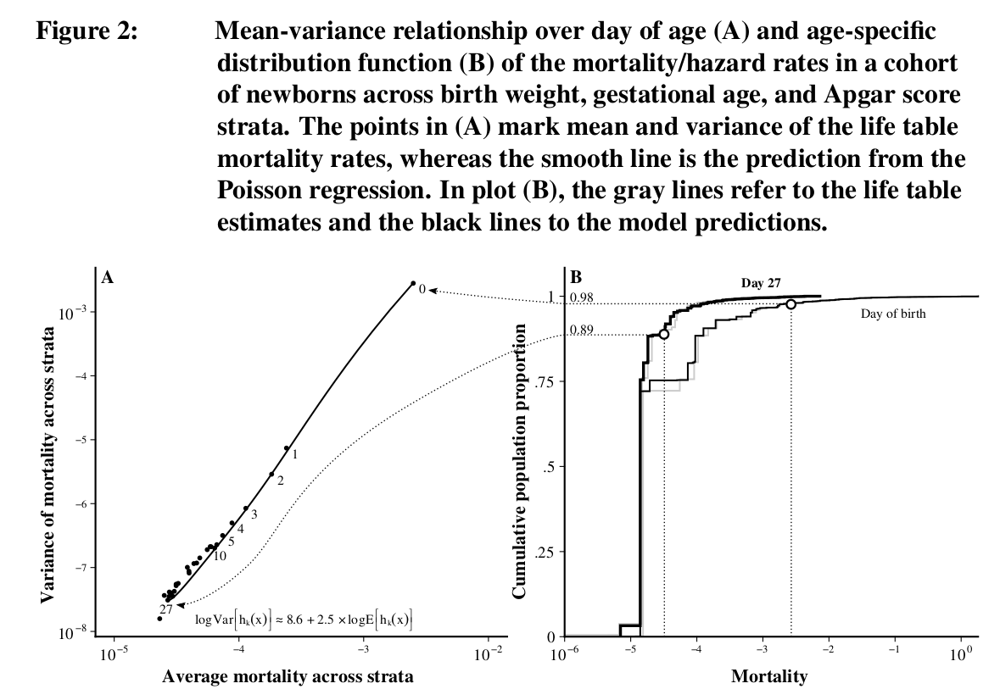

# The impact of population heterogeneity on the age trajectory of neonatal mortality

[Jonas Schöley](https://orcid.org/0000-0002-3340-8518)

**Background** The risk of death declines rapidly over the first month of life. It has been theorized that the fast pace of the decline is explained by hidden population heterogeneity resulting in a mortality selection process whereby the frailest infants leave the population at the fastest rate. A competing explanation situates the rapid mortality decline on the individual level, pointing towards the risky transition of birth and the subsequent adaptation of the newborn to the unfamiliar surroundings.

**Objective** To estimate heterogeneity in the level and shape of age-specific mortality within a cohort of newborns and to quantify the degree to which mortality selection explains the shape of the average neonatal mortality trajectory.

**Methods** Given individual-level data on 20,322,147 births and 82,562 neonatal deaths from the 2008-2012 U.S. birth cohort, I calculate life-tables for 252 mutually exclusive strata each defined by a unique combination of observed birth characteristics. Using this information, I characterize the distribution of mortality risk and its evolution over the first 28 days of life and decompose changes in key characteristics of this distribution -- the mean, the variance, and the mean-mode ratio -- into a mortality selection and a direct component.

**Results** The average age trajectory of neonatal mortality is highly influenced by a small group of frail newborns and does not reflect the rather flat age effect estimated for the healthy majority of the birth cohort. While the risk decline over the first day of life is substantially influenced by mortality selection, the overall age trajectory is better explained by the convergence of high-risk towards low-risk population strata.

**Contribution** I contribute an empirical test of the hypothesis that the age trajectory of mortality in the days and weeks following birth is an artifact of mortality selection.

## Analysis

Analysis files are provided for the R language. The R library dependencies are managed via `renv` with each dependency listed in `renv.lock`.

- `./src`
	- `00-download_input_data.R` Download the input data from Zenodo.
	- `10-calculate_stratified_lifetables.R` Prepare stratified neonatal life-tables and calculate summaries.
	- `20-fit_hougaard_gompertz_model.R` Analyze Hougaard-Gompertz model fit to neonatal life-tables.
	- `30-fit_stratified_hazards_model.R` Estimate stratum specific hazard trajectories.
	- `40-decomposition_analysis.R` Decompose the changing distribution of death rates over age into selection and convergence components.
	- `50-distribution_analysis.R` Analyze the distribution of mortality rates in a cohort of newborns.
- `./out`
	- `10-lifetab.rds` Neonatal life-tables.
	- `20-hougaard.rds` Data associated with the Hougaard-Gompertz fit to neonatal life-tables.
	- `30-hazards.rds` Data associated with the stratified hazards model.
	- `40-decomp.rds` Data associated with the decomposition analysis.
	- `50-distribution.rds` Data associated with the risk distribution analysis.